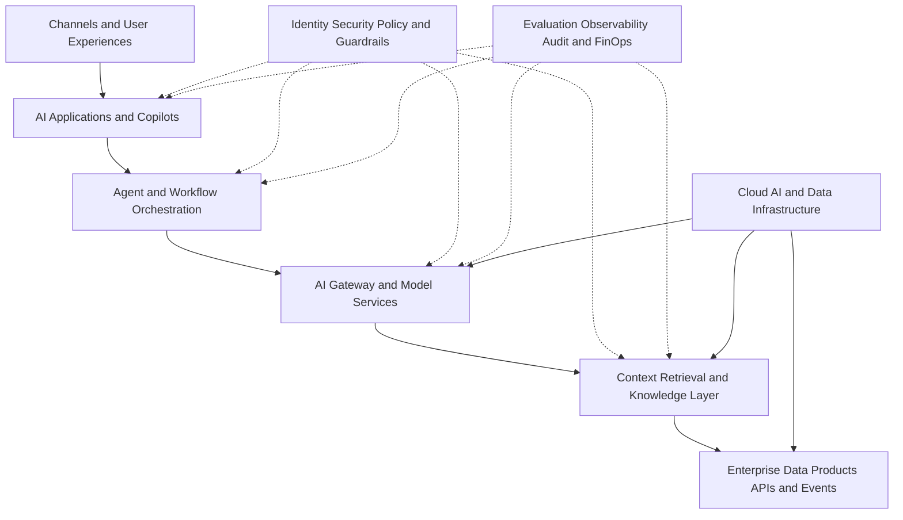

# Enterprise AI Architecture

A practical, vendor-neutral portfolio of enterprise AI reference architectures, decision frameworks, governance controls, and operating-model patterns.

This repository demonstrates how to move AI initiatives from isolated prototypes to secure, governed, reusable, and measurable enterprise capabilities.

## Portfolio objectives

- Translate business outcomes into AI architecture decisions
- Design deterministic controls around nondeterministic systems
- Connect AI applications to governed enterprise data and knowledge
- Establish evaluation, observability, security, and human accountability
- Compare build, buy, managed-service, and self-hosted choices
- Define reusable platform capabilities instead of one-off solutions

## Reference architecture

## Repository map

| Area | Purpose |
|---|---|
| [`docs/enterprise-ai-reference-architecture.md`](docs/enterprise-ai-reference-architecture.md) | Layered enterprise AI platform model |
| [`docs/ai-use-case-prioritization.md`](docs/ai-use-case-prioritization.md) | Scoring framework for selecting AI investments |
| [`docs/build-vs-buy-framework.md`](docs/build-vs-buy-framework.md) | Decision framework for platform and model sourcing |
| [`docs/ai-operating-model.md`](docs/ai-operating-model.md) | Roles, ownership, governance, and delivery model |
| [`docs/responsible-ai-controls.md`](docs/responsible-ai-controls.md) | Lifecycle control catalog |
| [`docs/ai-platform-roadmap.md`](docs/ai-platform-roadmap.md) | Phased enterprise adoption roadmap |
| [`decision-records/`](decision-records/) | Architecture Decision Records |
| [`threat-models/`](threat-models/) | RAG, agent, and data-leakage threat models |
| [`reference-architectures/`](reference-architectures/) | Focused architecture packages |

## Architecture principles

1. **Business outcomes before technology** — every capability must map to a measurable outcome.
2. **Deterministic controls around nondeterministic systems** — authorization, policy, workflow boundaries, and audit must not depend on model discretion.
3. **Data and context are products** — trusted context needs ownership, quality, lineage, access policy, and service expectations.
4. **Evaluation is a release gate** — quality, safety, latency, and cost must be tested before deployment.
5. **Human accountability remains explicit** — consequential decisions require named owners and appropriate review.
6. **Platform capabilities should be reusable** — identity, model access, retrieval, evaluation, and observability should not be rebuilt per use case.
7. **Portability is a design choice** — abstractions should be introduced only where they provide clear business value.

## Example scenarios

The examples use fictional organizations and synthetic information. They are intended for architecture learning and portfolio demonstration only.

## Status

Phase 2 foundation complete:

- Enterprise AI reference architecture
- AI use-case prioritization framework
- Build-versus-buy framework
- AI operating model
- Responsible AI control catalog
- Initial architecture decisions
- RAG and agent threat models

## Next implementation repository

The recommended companion implementation is `governed-enterprise-rag`, containing a working RAG system with access control, citations, evaluation, observability, and deployment automation.

## Author

**Rakesh Varma**  
Enterprise AI Architecture · GenAI · Agentic AI · AI-ready Data Platforms

## License

Released under the [MIT License](LICENSE).
