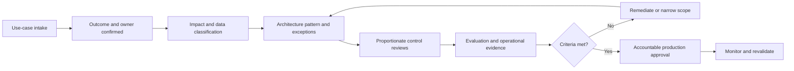

# Enterprise AI Platform Operating Model

## Objective

The operating model combines centrally managed platform capabilities with federated ownership of business use cases, workflows, data, and outcomes. It extends the repository's existing [enterprise AI operating model](../../docs/ai-operating-model.md) with delivery responsibilities, approval criteria, and production accountability.

## Roles and responsibilities

### Enterprise AI platform team

Owns the AI gateway, shared orchestration runtime, context and evaluation foundations, common telemetry contracts, reference patterns, service roadmap, onboarding support, and platform service objectives.

### Domain product teams

Own use-case discovery, product outcomes, domain workflows, prompts and configuration, domain evaluation cases, user adoption, product operations, and remediation of business-quality failures.

### Enterprise architecture

Maintains target-state boundaries, standards, reusable patterns, technology lifecycle, ADR quality, exception review, and cross-domain duplication management.

### Data owners

Approve access and purpose; own source meaning, quality, classification, lineage, retention, deletion, entitlement rules, and data-product contracts.

### Cybersecurity

Defines and assesses identity, network, application, tool, secrets, egress, supply-chain, threat-model, vulnerability, monitoring, and incident-response controls.

### Model risk and responsible AI

Defines risk-tiering and validation expectations; challenges intended use, evaluation, robustness, fairness where relevant, explainability, human oversight, monitoring, and material changes.

### Legal and compliance

Advises on applicable obligations, provider and data terms, disclosures, recordkeeping, intellectual property, privacy, consumer or employee impact, and prohibited or restricted uses.

### Site reliability and platform engineering

Owns runtime reliability, capacity, deployment controls, observability infrastructure, on-call processes, recovery testing, infrastructure security, and operational change practices.

### Business process owners

Own process policy, transaction rules, benefits, control design, approval thresholds, operating procedures, and acceptance of residual business risk.

### Human reviewers

Assess evidence for assigned decisions, approve or reject within delegated authority, document rationale when required, identify anomalies, and escalate when evidence or authority is insufficient.

## RACI-style responsibility table

**A** = accountable, **R** = responsible, **C** = consulted, **I** = informed. Combined **A/R** indicates that one role both owns and performs the work. Actual assignments may add independent approval where required.

| Activity | AI platform | Domain product | Enterprise architecture | Data owner | Cybersecurity | Model risk / RAI | Legal / compliance | SRE / platform eng. | Process owner | Human reviewer |
|---|---|---|---|---|---|---|---|---|---|---|
| Define business outcome and intended use | C | R | C | C | I | C | C | I | A | I |
| Assign risk tier and review path | I | R | C | C | C | A | C | I | C | I |
| Approve data access and purpose | I | R | I | A | C | C | C | I | C | I |
| Define shared platform standards | A/R | C | C | I | C | C | I | R | I | I |
| Design domain workflow and controls | C | R | C | C | C | C | C | C | A | C |
| Threat model and security validation | C | R | C | C | A | C | C | C | I | I |
| Build and run evaluation suite | C | A/R | I | C | C | C | I | C | C | C |
| Independent model / impact review | I | R | I | C | C | A | C | I | C | C |
| Production release decision | C | R | C | C | C | C | C | R | A | I |
| Operate shared platform | A | I | I | I | C | I | I | R | I | I |
| Monitor business quality and outcomes | C | R | I | C | I | C | I | C | A | C |
| Review consequential action | I | I | I | I | I | C | I | I | A | R |
| Respond to AI-enabled incident | R | R | I | C | A/R | C | C | R | C | I |
| Approve material change | C | R | C | C | C | A | C | C | A | I |

## Centralized versus federated ownership

Centralize capabilities where consistency, purchasing leverage, scarce expertise, or a shared control boundary creates clear value:

- AI gateway and approved-model catalog
- Workload identity integration, secrets, egress, and core security patterns
- Shared orchestration runtime and tool-registration standard
- Evaluation framework, trace contract, and audit-event schema
- Common context-service interfaces and platform delivery pipelines
- Provider management, common FinOps controls, and platform reliability

Federate decisions that require domain meaning, direct accountability, or source ownership:

- Use-case outcomes, user experience, and operating procedures
- Domain workflows, prompts, business rules, and approval thresholds
- Data products, access decisions, ontologies, and source quality
- Domain evaluation datasets, acceptance thresholds, and feedback triage
- Benefits measurement, adoption, product support, and business-quality monitoring

The center supplies a supported path and mandatory control boundaries. Domains do not outsource outcome or data accountability to the platform team. The platform team does not become a delivery queue for every domain feature. See [ADR-002](decisions/ADR-002-centralized-vs-federated.md).

## Use-case onboarding process

1. **Frame the outcome.** Identify the process owner, users, intended and prohibited uses, measurable outcome, and why AI is appropriate.
2. **Classify impact and data.** Record affected parties, autonomy, data classifications, jurisdictions, tools, and potential consequences; assign a preliminary review tier.
3. **Confirm ownership.** Name product, data, process, technical, risk, security, and production-support owners.
4. **Select approved patterns.** Map the use case to platform services, architecture principles, threat models, context sources, and required exceptions.
5. **Define evaluation.** Establish representative cases, baselines, acceptance criteria, access-control tests, human-review tests, latency, cost, and resilience expectations.
6. **Prototype within bounds.** Use synthetic or approved data, scoped credentials, non-production tools, budgets, and recorded assumptions.
7. **Complete reviews.** Resolve architecture, data, security, privacy, legal, compliance, model-risk, responsible-AI, and operational findings proportional to impact.
8. **Productionize and approve.** Produce release evidence, runbooks, monitoring, rollback, incident ownership, user guidance, and final accountable approvals.
9. **Operate and revalidate.** Monitor outcomes and controls; reassess material changes to models, prompts, context, tools, user population, or intended use.

## Architecture and risk review flow

Architecture and risk reviews should share one evidence set. Review functions retain independent decision rights, but duplicate requests for the same artifact should be removed from the process.

## Production approval criteria

A use case is ready for production only when evidence demonstrates:

- Named business, product, data, technical, risk, and operational owners
- Approved intended use, users, data purpose, sources, and tool permissions
- Architecture review completed and exceptions documented with expiry or revisit conditions
- Threat model and required security, privacy, legal, and compliance controls completed
- Versioned evaluation results meet approved quality, safety, access-control, latency, resilience, and cost criteria
- Consequential decisions have meaningful human accountability and tested approval paths
- End-to-end tracing, protected audit evidence, dashboards, alerts, and retention are configured
- Capacity, service objectives, support model, incident process, rollback, safe degradation, and kill switch are tested
- User guidance, limitations, feedback, and escalation routes are available
- Material-change triggers and revalidation owner are recorded

Approval is not a permanent certification. It applies to a defined use, architecture, data scope, model and configuration set, and operating environment.

## Post-production monitoring responsibilities

| Monitoring area | Primary responsibility | Required response |
|---|---|---|
| Business outcome and adoption | Domain product and process owners | Investigate benefit gaps, misuse, workflow friction, and unintended process effects. |
| Response and retrieval quality | Domain product team | Review samples and feedback, run scheduled evaluations, and remediate regressions. |
| Model and provider change | AI platform and model governance | Assess impact, run regression gates, communicate change, and invoke fallback or rollback when required. |
| Data quality, access, and freshness | Data owners | Correct source or entitlement failures, reindex safely, and assess affected outputs. |
| Security and privacy signals | Cybersecurity and privacy | Triage alerts, contain exposure, preserve evidence, and coordinate incident response. |
| Responsible AI and human impact | Model risk / responsible AI and process owner | Review control effectiveness, complaints, subgroup effects where relevant, and revalidation triggers. |
| Availability, latency, and capacity | SRE / platform engineering | Restore service, apply safe degradation, manage capacity, and complete incident review. |
| Cost and consumption | AI platform, FinOps, and domain product | Investigate anomalies, enforce budgets, and optimize without bypassing quality or control thresholds. |
| Human approval effectiveness | Business process owner | Monitor overrides, review time, escalation, reviewer workload, and rubber-stamping indicators. |
| Audit evidence completeness | AI platform, cybersecurity, and governance | Repair telemetry gaps, protect records, and pause high-impact actions when evidence is insufficient. |

Material incidents or changes can require traffic restriction, rollback, model removal, tool disablement, renewed approval, or retirement. Emergency decision rights and communication paths must be documented before launch.
