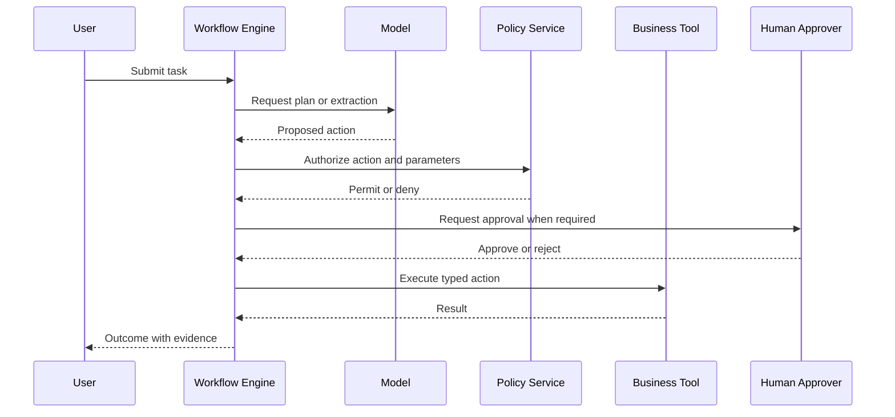

# Agent Security Threat Model

## Primary concern

An agent can convert model output into real-world actions. Therefore, tool authorization and workflow control must remain outside the model.

## Threats and controls

| Threat | Control |
|---|---|
| Unauthorized tool selection | Per-state tool allowlist and service-side authorization |
| Parameter manipulation | Typed schemas, validation, normalization, business-rule checks |
| Excessive autonomy | Step, time, token, and cost budgets |
| Duplicate action | Idempotency keys and durable workflow state |
| Approval bypass | Approval service controls transition; model cannot self-approve |
| Compromised external content | Treat tool output as untrusted data |
| Memory poisoning | Scoped memory, provenance, expiration, and write controls |
| Cascading agent error | Confidence thresholds, reconciliation, and bounded delegation |
| Poor accountability | Immutable action log with user, model, prompt, tool, and approver metadata |

## Controlled sequence

