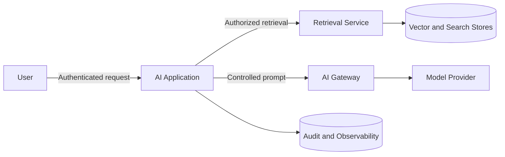

# RAG Threat Model

## Protected assets

- Restricted documents
- User identity and entitlements
- Retrieved context
- Prompts and responses
- Model credentials
- Evaluation and audit records

## Trust boundaries

## Key threats and controls

| Threat | Example | Controls |
|---|---|---|
| Unauthorized retrieval | User receives restricted policy | Identity-aware filters, deny-by-default, authorization tests |
| Indirect prompt injection | Document instructs model to reveal secrets | Content isolation, instruction hierarchy, tool separation |
| Data exfiltration | Sensitive context sent to unapproved model | Gateway policy, DLP, provider allowlist, egress control |
| Retrieval poisoning | Malicious content inserted into corpus | Source approval, integrity checks, provenance, moderation |
| Citation spoofing | Answer cites irrelevant source | Citation validation and retrieval-grounding evaluation |
| Cross-tenant leakage | Cache or index mixes tenants | Tenant-scoped keys, partitions, filters, tests |
| Secret exposure | Credential enters prompt or logs | Secret scanning, redaction, structured logging |
| Denial of wallet | Excessive long-context requests | Rate limits, context limits, cost budgets |

## Security test cases

- User with public access cannot retrieve internal or restricted documents
- Retrieved document instructions cannot override system policy
- Model calls fail closed when the requested provider is not approved for the data classification
- Logs do not contain raw secrets or prohibited sensitive fields
- Cached answers preserve the original authorization boundary
